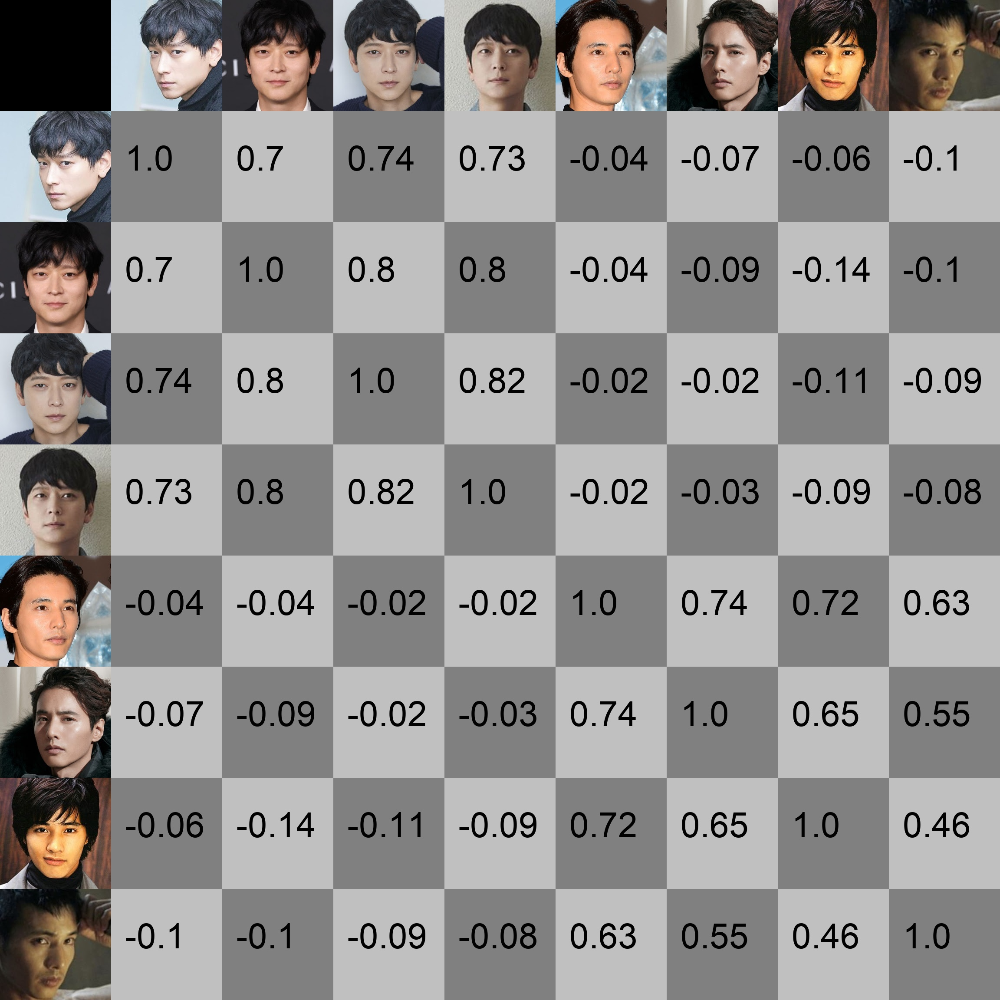
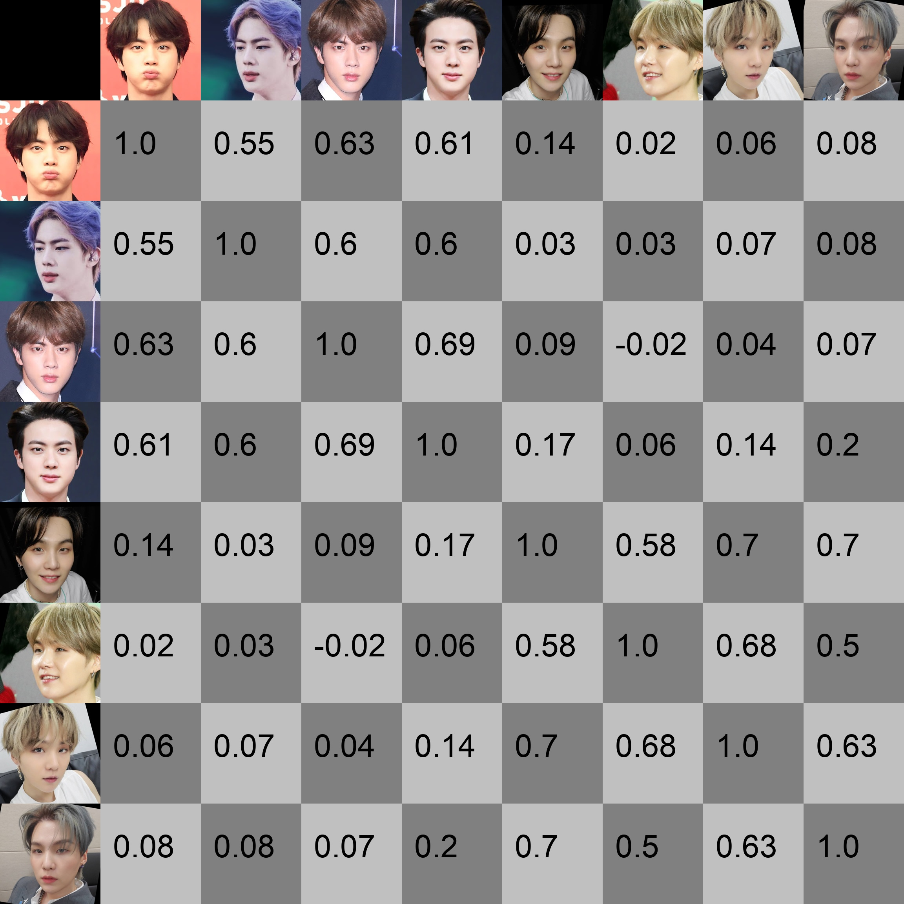

# Simple CurricularFace 
This repository is a simplified version of the [official PyTorch implementation of CurricularFace](https://github.com/HuangYG123/CurricularFace).  
This will be useful for those who want to train the model on a custom dataset or with the specific option.  

- Kang Dong Won & Won Bin
<p align="center"></p>

- Kim Suk Jin & Min Yun Ki
<p align="center"></p>

# Usage
## test
1. download checkpoint from [here](https://github.com/HuangYG123/CurricularFace)
2. simple test
```
python scripts/test.py
```

3. make a grid
```
python scripts/grid.py
```

## Dataset
1. Download **MS-Celeb-1M-Align_112x112 (85K ids/5.8M imgs)** from [here](https://github.com/ZhaoJ9014/face.evoLVe#data-zoo)
2. unzip the zip file and make a lst file.
```
python im2rec.py --list --resize 112 --recursive {prefix} {path_to_imgs} 
ex) python im2rec.py --list --resize 112 --recursive ./my_data ../dataset/ms1m_align_112_imgs
```
3. simple modification in code
- use wandb instead of tensorboard
- add a line, "if cfg['RANK'] % ngpus_per_node == 0:", when a multi processing error occurs
- fix a few lines in 'dataset.py' as below:
```
- line 71: image_dir = line[0]--> image_dir = line[2]
- line 74: image_dir, label = line[0], line[1] --> image_dir, label = line[2], line[1]
- line 75: label = int(label) --> label = int(float(label))
```

## train 

1. set path in "config.py"
```
- line 5: DATA_ROOT = '~/dataset/ms1m_align_112_imgs', # the parent root where your data are stored
- line 6: RECORD_DIR = '~/CurricularFace/my_data.lst', # the dataset record dir
```

2. train
```
python scripts/train.py
```

## Contributors to this repository
Yukyeong Lee | yukyeongleee@gmail.com  
Wonjong Ryu | 1zong2@innerverz.com  

## Reference
[CurricularFace](https://github.com/HuangYG123/CurricularFace)

## Citing CurricularFace
If you find this code useful in your research, please consider citing the authors:
```
@article{huang2020curricularface,
	title={CurricularFace: Adaptive Curriculum Learning Loss for Deep Face Recognition},
	author={Yuge Huang and Yuhan Wang and Ying Tai and  Xiaoming Liu and Pengcheng Shen and Shaoxin Li and Jilin Li, Feiyue Huang},
	booktitle={CVPR},
	pages={1--8},
	year={2020}
}
```


